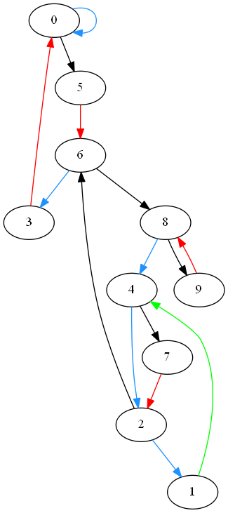

# Reduced Collatz Solver
We present an explicit algorithmic realization of the reduced Collatz map, based on finite macro-jump functions, that exit all nontrivial residue traps.
The construction refines the classical accelerated Collatz dynamics by partitioning the integers into residue-based cycles and providing algebraically bounded exit maps for each cycle.
While not yielding a closed-form solution to the Collatz conjecture, this work gives a concrete executable framework, consistent with parity-vector theory and known valuation bounds.

## The Modulo-10 Transition Graph

To organize the reduced Collatz dynamics, we consider the induced transition graph on last digits modulo 10. Each node corresponds to a residue class  
d ∈ {0, …, 9}, and directed edges represent possible last-digit transitions under a single Collatz step.

For odd values of n, the transition is uniquely determined by the map n → 3n + 1. For even values of n, the transition depends on the prefix parity of n, resulting in two possible outgoing edges.

The resulting directed graph is shown below.

Arrow colors indicate the dependence on prefix parity:
- **Blue arrows**: apply when the prefix is even  
- **Black arrows**: apply when the prefix is odd  
- **Red arrows**: represent deterministic transitions  
- **Green arrow**: applies for all ( n > 1 )
